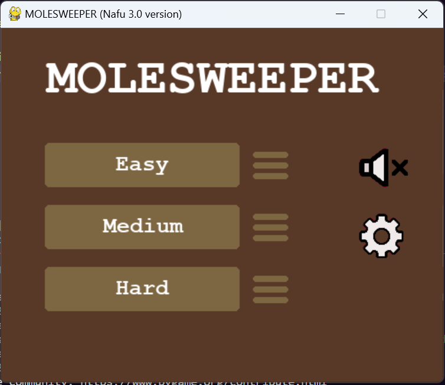
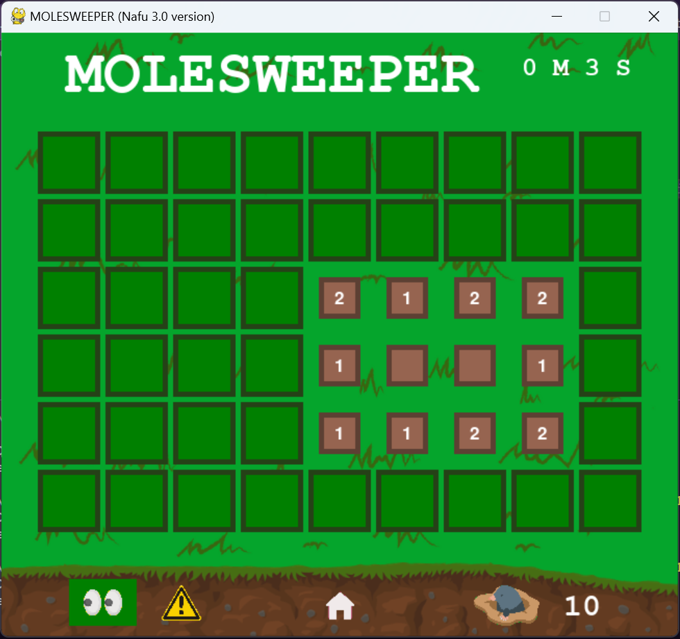
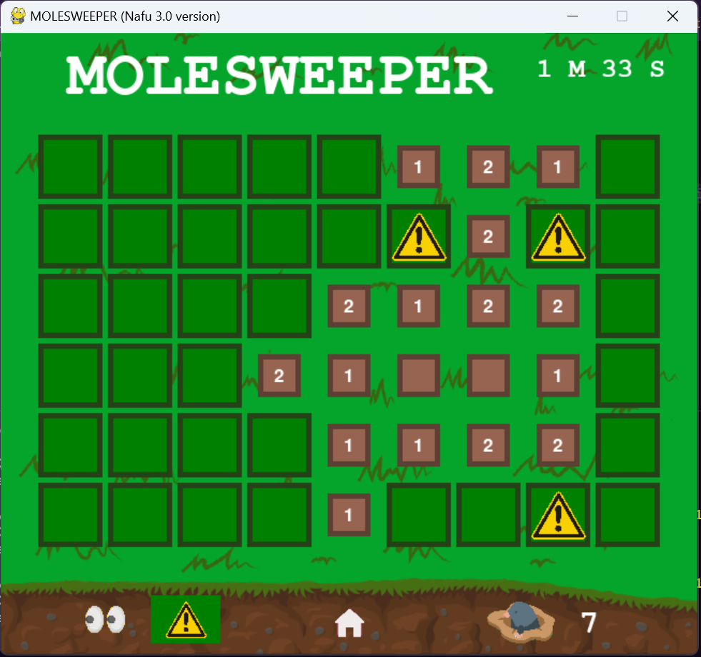
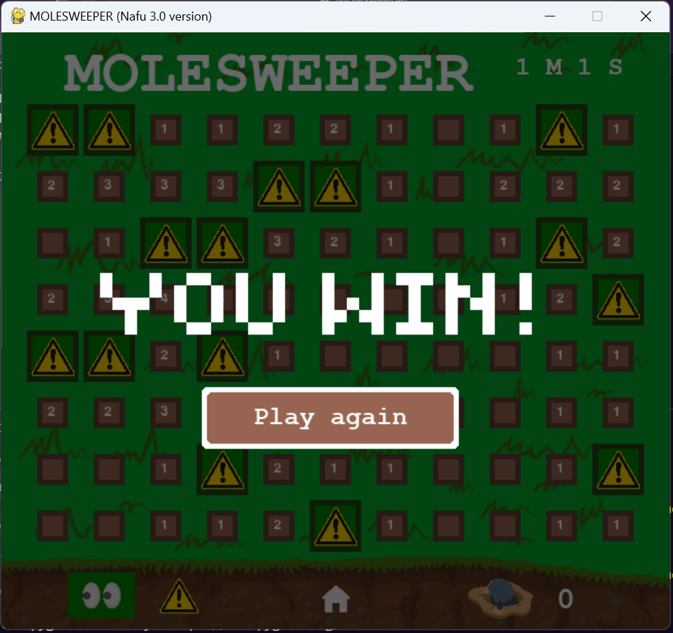

# Molesweeper
## Description 🌱
Hi! Welcome to my project!<br>
Molesweeper is a game that is based on the famous game "Minesweeper", but it has a theme of moles. The objective of the game is to uncover the squares that do not have a mole underneath, using the clues given by the numbers in the discovered squares.<br>
For this project, I adapted a console game of Minesweeper that I previously developed for an introductory class of Python. I wanted to improve the interaction of the user with the game, so I used the pygame library.<br>
Through the development of this project, many people played my game and made suggestions that helped me improve it, like adding difficulty levels and a list of rankings, and helped me find mistakes in the game.

## Install and run the project 💻⚙️
1. Make sure that your computer has [python](https://www.python.org/downloads/) installed.
2. Install pygame:
    ```sh
    pip install pygame
    ```
2. Download the ZIP of the project, and extract the ZIP file.
3. Open a console in the path of the Molesweeper-main folder, and execute the following line:
    ```sh
    python Molesweeper/main.py
    ```
4. Enjoy!

## How to play 🕹️
On the main window, you can choose the difficulty level with the Easy, Medium, and Hard buttons, turn on/off the audio in the sound button, change the background of the game with the configuration button, and see the rankings list of each level with the three lines besides their respective difficulty levels.<br><br>
<br><br>
When playing, you can choose either to reveal a square, selecting the eyes, or to mark a square as a mole, selecting the triangle alert.<br><br>

<br><br>
On the top right corner, you can see the time you've taken.<br>
In the bottom, you can see the amount of moles that are still left and you can return to the main window with the house button.<br>
Feel free to play as many times as you want!<br><br>

